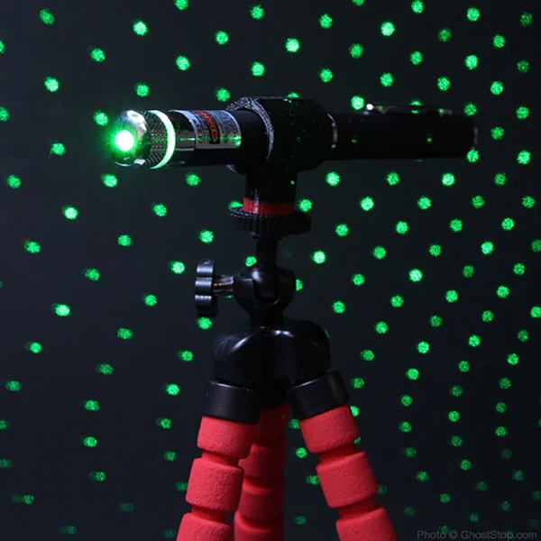
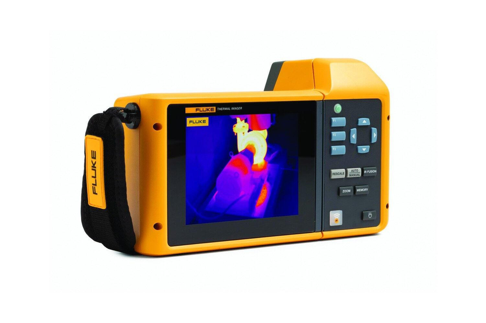
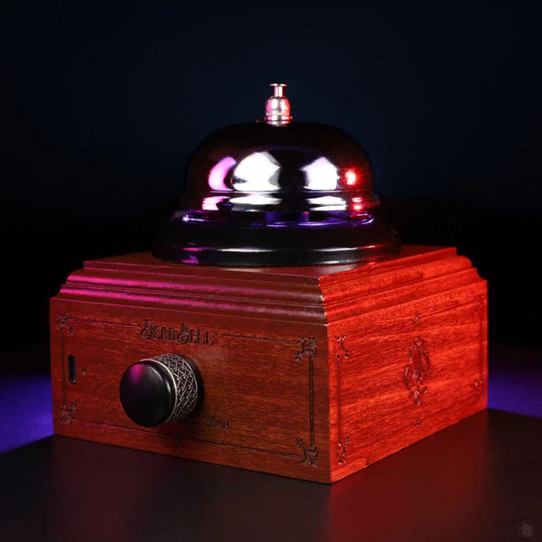

% Ghost Hunting Tech
% Rob <robert@rtward.com> & Joe <kamikazejoe@gmail.com>
% Talk: [${TALK_URL}](${TALK_URL}) Repo: [${REPO_URL}](${REPO_URL})

# Intro

# Analog Tech

## Oujia Board

::: notes

Rob

 - Around since the 1800s
 - Evolution of "talking boards"
 - Name doesn't mean anything, was just a trademark
 - The board supposedly named itself
 - Was considered a game until the early 1900s
 - Fairly cheap (just wait until later in the talk)

:::

## What is it?

 - Latin Alphabet, Numbers, and Yes / No
 - A "Planchette" (pointing device)
 
## The Theory

 - A user or users place their hands on the planchette
 - Spirits will move them to communicate
 
## The Science

 - Ideomotor effect

::: notes

Rob

 - Used to describe any "unconcious" motor movement
 - Long studied phenomenon in both scientific and paranormal circles

:::

## Spirit Dice

::: notes
Joe

:::

## What is it?

- A set of dice, usually 12-15
- Each side containing a letter

::: notes

Joe

Basically, Boggle dice.
Not strictly unique A-Z characters.
Includes multiple duplicates of commonly used letters to increase the chance of a word appearing.

:::

## The Theory

- As with a Ouji Board, Spirits will manipulate the dice as they a rolled
- Allow for faster communication.

::: notes

Joe

Rather than slowly spelling out words as with a Ouji board,
A spirit can provide whole words or short phrases.

:::

## The Science

- Poorly Constructed
- Designed to generate words

::: notes

Joe

Firstly, they are crap dice.
A lot of these are 3D printed now, which makes for uneven surfaces and poor balance.  They can't be truley "random" dice, and will always have a bias.  Even if just a little.

As people who make them describe it, these dice are designed to spell out words.  Otherwise they would be useless.

If you just put a single alphabet character on each side of a set of dice, you'd hinder the ability to spell most words.

For example; If A-F are on the first dice, you could never spell any word that contained both A,B,C,D,E or F.

Ultimatley you are just playing the game Boggle with yourself.  Your own biases are just reading into the rest of it.

I watched these get used at Lemp, and they wre reading into thing hard.  Accepting "Yup, Yea, Ya" and other modern slang as affirmitive answers to questions to supposed entities who died 100 years ago.

Now maybe if you could have a controlled sample... Ask a spirit to repeat the same unlikely word over several rolls.

:::

## Dowsing Rods

::: notes

Rob

 - A type of "divination" used to locate things
 - Commonly used for finding water, ore deposits, oil, graves, or other specific spots
 - Also called divining or water witching
 - Banned by christian churches (catholic and protestent) since the middle ages
 - Used for finding hidden bombs
 - Cheap to Expensive

:::

## What is it?

 - Most common types are:
 - A Y shaped twig of willow or hazel
 - Two L shaped rods

## The Theory

 - "Eminations" from the obejct in question move the rods
 - The rods are a tool for unconcious thought

## The Science

 - Multiple studies show they're no more effective than random chance
 - Likely the ideomotor effect

## Scrying

::: notes

Rob

 - Another type of divination 
 - Relies on visions *within* the medium
 - Has a long history
 - Intertwined with other forms of divination with no hard definition

:::

## What is it?

 - Using a medium to receive visions
 - Crystals, flames, water, and mirrors are common

## The Theory

 - Access your subconcious
 - Receive visions from other planes of existence

## The Science

 - Suggest that people may be accessing hallucinations or altered conciousness

# Digital Tech

## Laser Grid

::: notes

Joe

:::

## What is it?

- Basic Laser Pointer
- Grid Effect Filter attached
- Usually tripod mounted

::: notes

Joe

As oppose to some of these things, these don't generally break the bank.
Often $20-30.  If you are shopping on a "Ghost Hunting" site, add another $10-20.

:::

## The Theory

- Light bounces, bends, or is blocked by objects
- If you see something, you are seeing light
- A visible apparition would be no different.

::: notes

Joe

If you see an apparition, even if it's translucent, it's reflecting or filtering light.

Even if it's some kind of ominous shadow, that is also sometimes reported, that's something blocking light.

:::

## The Science

::: notes

Joe

This is one I actually had some hope behind.

It's actually a good idea:

A laser grid would provide a measurable, accurate, way to see anything you can see passing through the room by blocking the laser and distorting the grid.  Even if an apparition was translucent, because you can see it partially, those beams would partially distort.

At Lemp, the ghost hunters had laser grids.

But where they failed was when they were getting excited over every little flicker on the wall.

In most cases were just framed art shaking a bit when a truck or something flew down the interstate right next to the building.

:::

## IR Thermometer

::: notes

Rob

 - Useful for cooking and HVAC work as well
 - A very good one will set you back $100

:::

## The Theory

 - Sudden temperature changes (chills) can indicate the presense of unseen entities

## The Science

 - Sudden temperature changes mean you left a window open

## Thermalgraphic Camera

::: notes

Joe

:::

## What is it?

- Camera that sees infrared

::: notes

Joe

They are generally designed for inspecting HVAC and Electrical,
Or for intergalactic safari hunters (Predator).

They measure the surface or reflective radiant heat from an object.

They have gotten cheaper in recent years.  Down from thousdands of dollars to hundreds.  Some cheap ones even under $100.

Cheaper cameras have lower pixel counts (often less than 100x100 pixels) and slow refresh rates (15-25FPS).

:::

## The Theory

- Mapping "Cold Spots"
- Perhaps viewing an entity in low light environment.

::: notes

Joe

On the surface the logic is sound.
It's a temperature camera.  I should be able to see temperature changes, right?
And you can also see people, even when behind an obstruct (provided that obstruction is thermally transparent)

:::

## The Science

::: notes

Joe

This is just flat out the wrong tool for the job.
These cameras are limited to surface temperatures.

Just like you don't see light moving through the air, 
these cameras don't see the infrared heat in mid-air

There is no way you could spot a cold area in the middle of the room.

They can also pick up reflections like regular cameras.  
When you are seeing what you think is something human shaped and no person is in front of you, it's often you are just seeing your own reflection from a surface you don't realize is thermally reflective.

:::

## EMF Detectors

::: notes

Rob

 - Electromagentic Field Detector
 - Can be useful for tracking down interference
 - $100 - $300

:::

## What is it?

 - A device for detecting electromagentic fields
 - Not quite the same as a reciever
 - "Probes" should disturb the fields less than an antenna
 - Can operate on a single or multiple axis

## The Theory

 - Ghosts and other supernatural phonomena interact with the EM spectrum

## The Science

 - They're useful tools for all sorts of engineering work

## EVP Recorder

::: notes

Rob

 - Could be as simple as a digital voice recorder
 - Could be a dedicated piece of hardware
 - Cheap to **very** expensive

:::

## What is it?

 - Often just a voice recorder
 - Can be an RF reciever

## The Theory

 - Similar to EMF
 - Ghosts can interact with electrical fields

## The Science

 - Many people claim to hear voices in recordings
 - Other explanations
 - Pareidolia

::: notes

 - e.g. interference, pareidolia

:::

## Dead Bell

## What is it?

- Recption style bell
- Selonoid driven
- EMF Sensor

::: notes

Joe

This one made me mad.

At first glance, a reception style bell?  Simple device.  Analog.  No suseptible to interference.

If this began ringing on it's own, yeah.  I'd probably think ghosts.

But that's not what this was.  The bell, was actually be driven by a selenoid connected to yet another EMF meter.

Except now with a heafty price tag between $200-300

:::

## The Theory

- Same as with EMF Detectors
- Allows for communication by asking Yes/No Questions

::: notes

Joe

Use the bell to let use know you are hear.
Ring once for yes, twice for no.

:::

## The Science

- Poor placement
- Calibration

::: notes

Joe

At Lemp, these were frequently placed on shelves or tables.  Know what else was on those tables?  Lamps.  Lamps that flickered every time the AC would kick on (which got everyone very excited, btw)

There's a knob on these to adjust their sensitivity.  But how do you calibrate for ghosts without some kind of baseline?  Not to mention the wiring in every old building is going to be different.

Now there are actual analog spirit.  Little bells that hang freely from a stand. Make sure they aren't in front of a vent or fan, and I might ackowledge evidence of those ringing.

:::

## Spirit Box

::: notes

Rob

 - Kind of a combined EMF detector and EVP recorder
 - Can get very expensive
 - US detected EM fields to produce output

:::

## The Theory

 - Similar to EMF
 - Scanning radio frequencies rapidly
 - Assebles a signal from the noise

## The Science

 - Pareidolia

# Apps

::: notes

Joe

:::

## What is it?

- Sound banks of phonomes
- No actual words
- Carefully mixed across audio frequencies
- Randomly plays audio from the sound bank

::: notes

Joe

Phonomes being the smallest unit of spoken language.

The idea is that these are basically an app version of the Spirit Box

:::

## The Theory

- Similar to Spirit Boxes
- Sound bank allows spirits to construct words

::: notes

Joe

As with other EMF or EVP devices, the idea is to provide raw audio material that spirits can manipulate and chain together and attempt to communicate.

:::

## The Science

::: notes

Joe

These are most likely scams.

Randomization on digital devices is so complicated that we did an entire talk on that subject alone a few years ago.

I'm pretty good with this stuff, and I barely understand it myself.

But the ghost of someone that died a hundred years ago, before smart phones were even a notion, is expected to understand how to manipulate the randomization function, in a device that is hopefully design to resist exactly that for security purposes?  So every ghost is suddenly a master hacker now?

As soon as the ghost hunters pulled out one of these apps, I was out.

Also, black jack.  Looking for answers.

:::

# The End

---

Rob <robert@rtward.com> & Joe <kamikazejoe@gmail.com>

Talk: [${TALK_URL}](${TALK_URL})

Repo: [${REPO_URL}](${REPO_URL})
