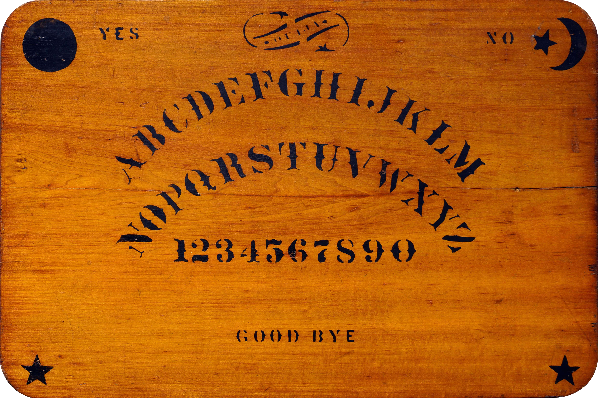
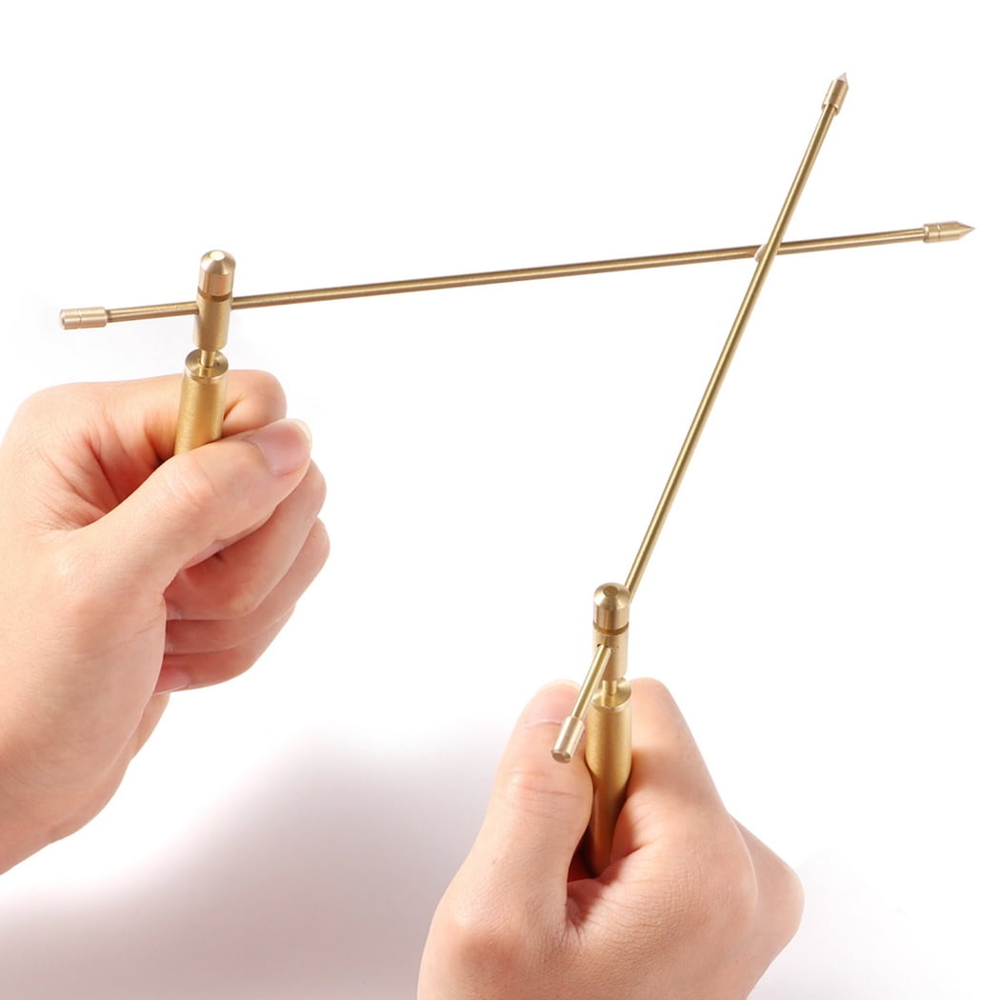
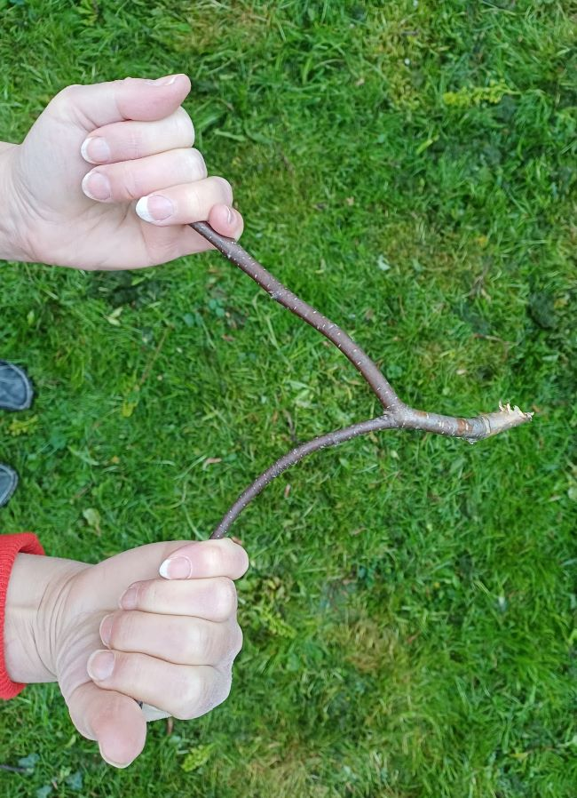
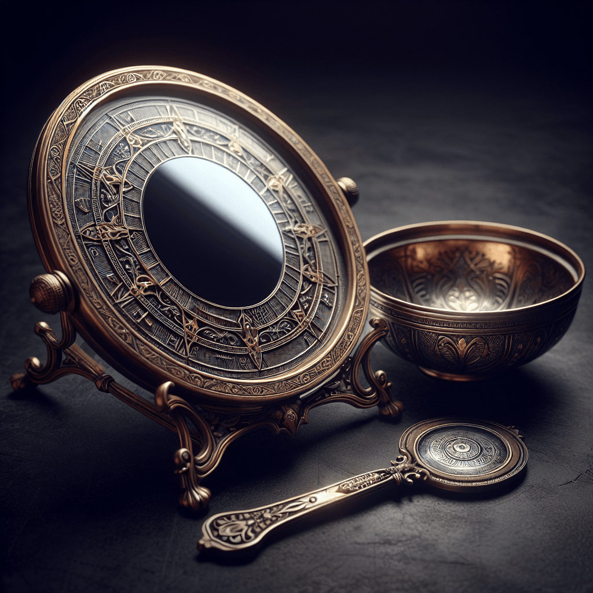
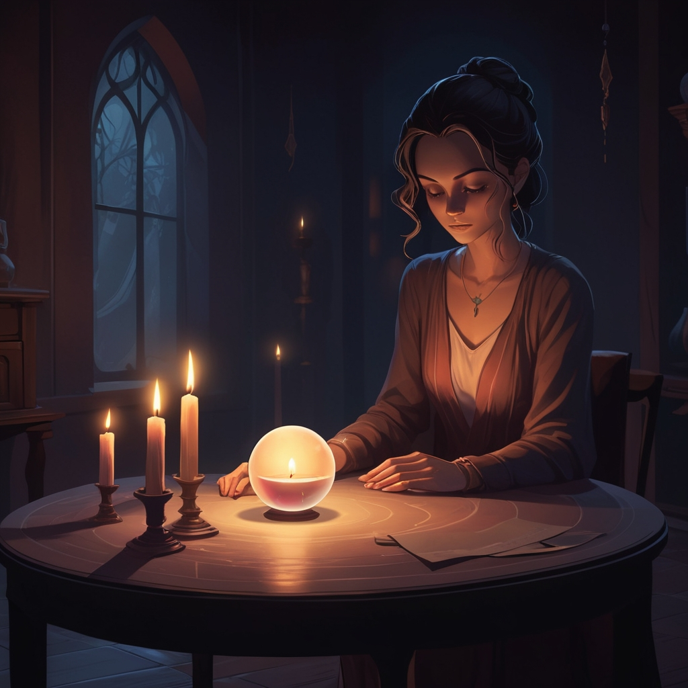
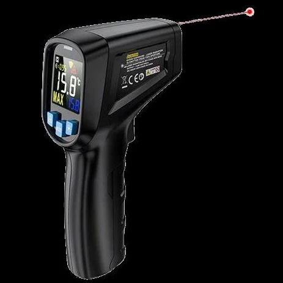

% Ghost Hunting Tech
% Rob <robert@rtward.com> & Joe <kamikazejoe@gmail.com>
% Talk: [${TALK_URL}](${TALK_URL}) Repo: [${REPO_URL}](${REPO_URL})

# Intro

# Analog Tech

## Oujia Board

::: notes

Rob

 - Around since the 1800s
 - Evolution of "talking boards"
 - Name doesn't mean anything, was just a trademark
 - The board supposedly named itself
 - Was considered a game until the early 1900s
 - Fairly cheap (just wait until later in the talk)

:::

## What is it?

 - Latin Alphabet, Numbers, and Yes / No
 - A "Planchette" (pointing device)
 
## The Theory

 - A user or users place their hands on the planchette
 - Spirits will move them to communicate
 
## The Science

 - Ideomotor effect

::: notes

Rob

 - Used to describe any "unconcious" motor movement
 - Long studied phenomenon in both scientific and paranormal circles

:::

## Spirit Dice

::: notes

Joe

:::

## Dowsing Rods

::: notes

Rob

 - A type of "divination" used to locate things
 - Commonly used for finding water, ore deposits, oil, graves, or other specific spots
 - Also called divining or water witching
 - Banned by christian churches (catholic and protestent) since the middle ages
 - Used for finding hidden bombs
 - Cheap to Expensive

:::

## What is it?

 - Most common types are:
 - A Y shaped twig of willow or hazel
 - Two L shaped rods

## The Theory

 - "Eminations" from the obejct in question move the rods
 - The rods are a tool for unconcious thought

## The Science

 - Multiple studies show they're no more effective than random chance
 - Likely the ideomotor effect

## Scrying

::: notes

Rob

 - Another type of divination 
 - Relies on visions *within* the medium
 - Has a long history
 - Intertwined with other forms of divination with no hard definition

:::

## What is it?

 - Using a medium to receive visions
 - Crystals, flames, water, and mirrors are common

## The Theory

 - Access your subconcious
 - Receive visions from other planes of existence

## The Science

 - Suggest that people may be accessing hallucinations or altered conciousness

# Digital Tech

## Laser Grid

::: notes

Joe

:::

## IR Thermometer

::: notes

Rob

 - Useful 

:::

## The Theory

 - Sudden temperature changes (chills) can indicate the presense of unseen entities

## The Science

 - Sudden temperature changes mean you left a window open

## FLIR Camera

::: notes

Joe

:::

## EMF Detectors

::: notes

Rob

:::

## EVP Detectors

::: notes

Rob

:::

## Dead Bell

## Spirit Box

::: notes

Rob

:::

# Apps

::: notes

Joe

:::

# The End

---

Rob <robert@rtward.com> & Joe <kamikazejoe@gmail.com>

Talk: [${TALK_URL}](${TALK_URL})

Repo: [${REPO_URL}](${REPO_URL})
